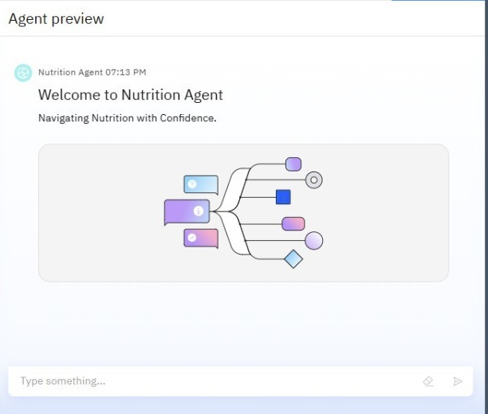
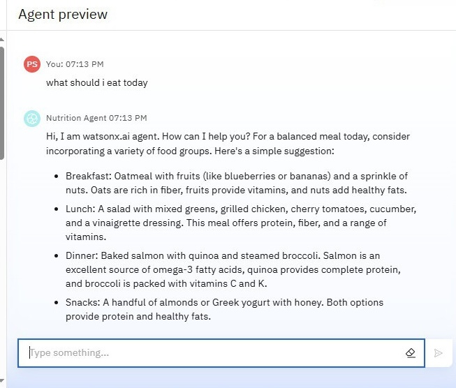
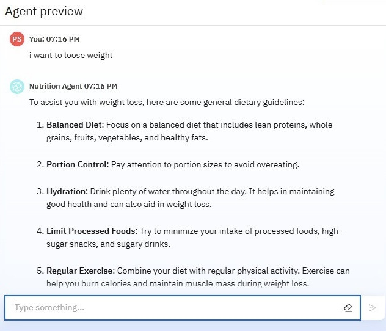

# 🧠 Nutrition Agent – IBM Watsonx Studio Project

This project is an AI-powered **Nutrition Assistant** developed using IBM Watsonx Studio. It provides diet advice, food analysis, and fitness tips based on user inputs.

## 📂 Project Structure

```
Nutrition-Agent-watsonx-NewRepo/
├── assets/
│   └── images/         # Screenshots and visuals
├── datasets/           # Nutrition datasets (if any)
├── notebooks/          # Watsonx notebooks
├── watsonx/            # Configuration and agent logic
└── README.md           # Project overview
```

## 📸 Screenshots

### 🤖 Agent Welcome Screen


### 🍏 Nutrition Suggestions


### ⚖️ Weight Loss Advice


### 🧪 Watsonx Build Interface


## 👩‍💻 Built With
- IBM Watsonx Studio
- Python & AI APIs
- GitHub for version control

---

📝 **Maintainer**: Prerna Singh | BCA Cybersecurity | Sharda University
