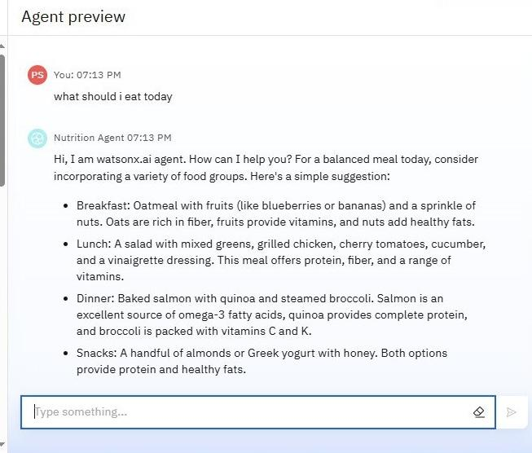
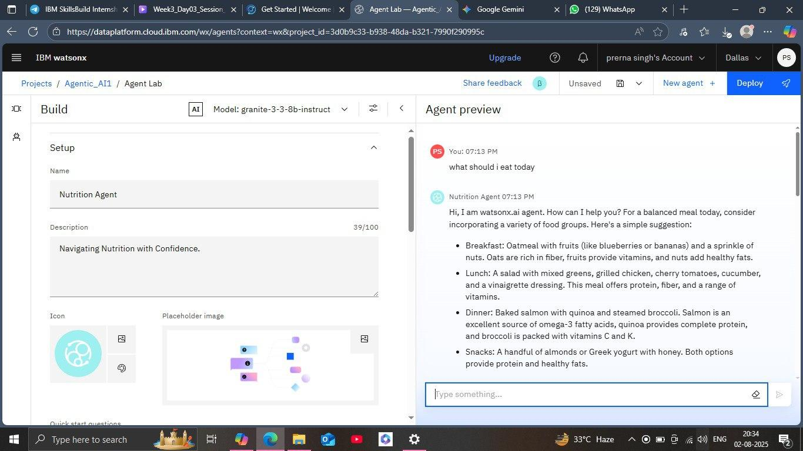

# 🧠 Nutrition Agent – IBM Watsonx Studio Project

This is a simple AI Nutrition Assistant built using **IBM Watsonx Studio**. The assistant provides personalized nutritional suggestions and insights using AI prompt engineering.

---

## 🖼️ Screenshots

### 👋 Agent Welcome Screen


### 🥗 Nutrition Suggestions


### ⚖️ Weight Loss Advice


### 🧠 IBM Watsonx Build Interface


---

## 📂 Project Structure
```
nutrition-agent-watsonx/
├── assets/
│   ├── agent_welcome.jpeg
│   ├── nutrition_suggestion.jpeg
│   ├── weight_loss_advice.jpeg
│   └── watsonx_interface.jpeg
└── README.md
```

---

✅ Created by Prerna Singh  
🔗 [GitHub Repository](https://github.com/prernasingh834/Nutrition-Agent-watsonx)
